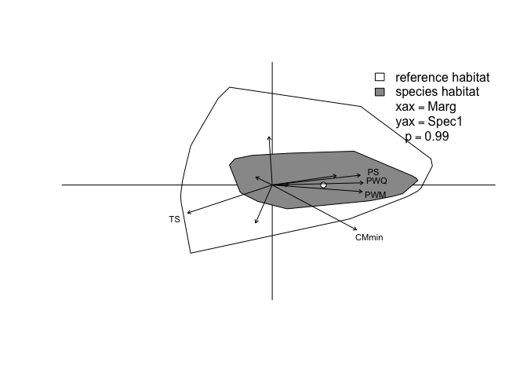
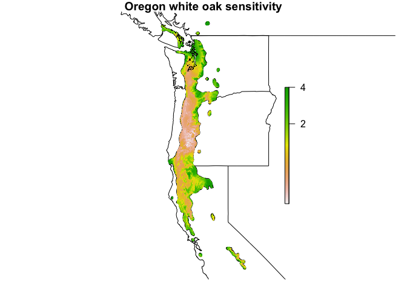
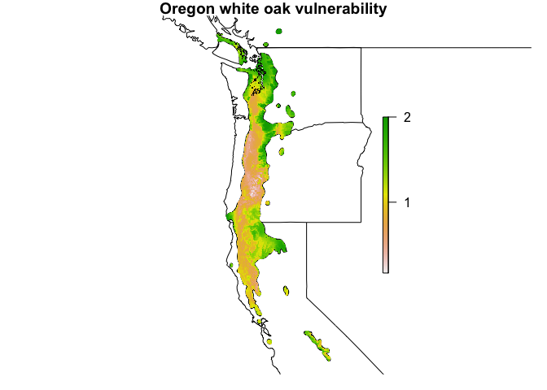

[](https://travis-ci.org/rinnan/CENFA)

CENFA: Climate and Ecological Niche Factor Analysis
===================================================

`CENFA` provides tools for performing ecological-niche factor analysis (ENFA) and climate-niche factor analysis (CNFA). This package was created with three goals in mind:

-   To update the ENFA method for use with large datasets and modern data formats.
-   To correct a critical error in the ENFA method itself, that has managed to persist since Hirzel et al. first introduced ENFA in 2002.
-   To expand the application of ENFA in the context of climate change in order to quantify different aspects of species vulnerability to climate change, and to facilitate quantitative comparisons of vulnerability between species.

`CENFA` takes advantage of the `raster` and `sp` packages, allowing the user to conduct analyses directly with raster, shapefile, and point data, and to handle large datasets efficiently via partial data loading and parallelization.

Installation
------------

You can install CENFA from GitHub with:

``` r
# install.packages("devtools")
devtools::install_github("rinnan/CENFA")
```

Examples
--------

### `enfa`

We will use some example datasets to perform a basic ENFA. The historical climate dataset `climdat.hist` is a RasterBrick of 10 climate variables, covering much of the western US coast. `QUGA` is a SpatialPolygonsDataFrame of the historical range map of Oregon white oak (*Quercus garryana*).

A plot of the data, using the one of the layers of `climdat.hist`:


The `enfa` function takes three basic arguments: the dataset of ecological variables (`climdat.hist`), the map of species presence (`QUGA`), and the values of `QUGA` that specify presence (in this case, a column named "CODE"). Calling the `enfa` object by name provides a standard summary of the ENFA results.

``` r
mod.enfa <- enfa(x = climdat.hist, s.dat = QUGA, field = "CODE")
mod.enfa
#> ENFA
#> 
#> Original function call: enfa(x = x, s.dat = s.dat.ras, filename = filename, quiet = quiet, 
#>     parallel = parallel, n = n, ...)
#> 
#> Marginality factor: 
#>   MDR   ISO    TS HMmax CMmin   PWM   PDM    PS   PWQ   PDQ 
#> -0.13  0.51 -0.67 -0.03  0.67  0.71 -0.13  0.70  0.72  0.13 
#> 
#> Eigenvalues of specialization: 
#>  Marg Spec1 Spec2 Spec3 Spec4 Spec5 Spec6 Spec7 Spec8 Spec9 
#>  5.12  8.92  4.82  3.01  2.55  2.01  1.28  0.77  0.68  0.36 
#> 
#> Percentage of specialization contained in ENFA factors: 
#>  Marg Spec1 Spec2 Spec3 Spec4 Spec5 Spec6 Spec7 Spec8 Spec9 
#> 17.36 30.24 16.32 10.20  8.64  6.80  4.33  2.61  2.30  1.21 
#> 
#> Overall marginality:  1.654 
#> 
#> Overall specialization:  0.543 
#> 
#> Significant ENFA factors: 
#>        Marg Spec1 Spec2 Spec3
#> PWQ    0.44  0.03 -0.19 -0.25
#> PWM    0.43 -0.08  0.26  0.27
#> PS     0.42  0.12 -0.11 -0.02
#> TS    -0.41 -0.34 -0.54  0.39
#> CMmin  0.40 -0.54  0.00  0.49
#> ISO    0.31  0.11 -0.46 -0.05
#> MDR   -0.08 -0.46  0.59  0.38
#> PDM   -0.08  0.10  0.09  0.03
#> PDQ    0.08  0.00 -0.11 -0.04
#> HMmax -0.02  0.58 -0.07 -0.57
```

### `scatter`

We can visualize the ENFA results via the `scatter` function, which produces a biplot of the marginality axis and one of the specialization axes. This gives us a portrait of the species' niche to compare with the global niche of the reference study area, with the ecological axes projected onto the ENFA dimensions. (Note: since `mod.enfa` only contains information about the species habitat, we must first construct a `GLcenfa` object that also describes the global habitat.)

``` r
glc <- GLcenfa(x = climdat.hist)
scatter(x = mod.enfa, y = glc)
```



For larger datasets, we can speed up the computation via parallelization. We provide two additional arguments, `parallel = TRUE`, and `n`, which specifies the number of cores to use. `n` has a default value of 1, so only setting `parallel = TRUE` will not parallelize the function by itself.

``` r
# does not enable parallelization
mod <- enfa(x = climdat.hist, s.dat = QUGA, field = "CODE", parallel = TRUE)

# enables parallelization across 4 cores
mod <- enfa(x = climdat.hist, s.dat = QUGA, field = "CODE", parallel = TRUE, n = 4)
```

The function will attempt to match the value provided to `n` with the number of cores detected on the local device via `parallel::detectCores()`; if the provided `n` is greater than the number of available cores `k`, a warning will be issued and `n` will be set to `k - 1`.

### `cnfa`

The `cnfa` function is very similar to `enfa`, but performs a slightly different analysis. Whereas ENFA returns a *specialization factor* (the eigenvalues of specialization) describing the amount of specialization found in each *ENFA factor*, CNFA returns a *sensitivity factor* that reflects the amount of sensitivity found in each *ecological variable*. This makes the sensitivity factor more directly comparable to the marginality factor, and more interpretable in the context of species' sensitivity to a given variable.

``` r
mod.cnfa <- cnfa(x = climdat.hist, s.dat = QUGA, field = "CODE")
mod.cnfa
#> CNFA
#> 
#> Original function call: cnfa(x = x, s.dat = s.dat.ras, filename = filename, quiet = quiet, 
#>     parallel = parallel, n = n, ...)
#> 
#> Marginality factor: 
#>   MDR   ISO    TS HMmax CMmin   PWM   PDM    PS   PWQ   PDQ 
#> -0.13  0.51 -0.67 -0.03  0.67  0.71 -0.13  0.70  0.72  0.13 
#> 
#> Sensitivity factor: 
#>   MDR   ISO    TS HMmax CMmin   PWM   PDM    PS   PWQ   PDQ 
#>  3.33  2.68  3.20  3.00  3.13  2.85  1.83  2.08  2.67  1.50 
#> 
#> Percentage of specialization contained in CNFA factors: 
#>  Marg Spec1 Spec2 Spec3 Spec4 Spec5 Spec6 Spec7 Spec8 Spec9 
#> 17.36 30.24 16.32 10.20  8.64  6.80  4.33  2.61  2.30  1.21 
#> 
#> Overall marginality:  1.654 
#> 
#> Overall sensitivity:  2.691 
#> 
#> Significant CNFA factors: 
#>        Marg Spec1 Spec2 Spec3
#> PWQ    0.44  0.03 -0.19 -0.25
#> PWM    0.43 -0.08  0.26  0.27
#> PS     0.42  0.12 -0.11 -0.02
#> TS    -0.41 -0.34 -0.54  0.39
#> CMmin  0.40 -0.54  0.00  0.49
#> ISO    0.31  0.11 -0.46 -0.05
#> MDR   -0.08 -0.46  0.59  0.38
#> PDM   -0.08  0.10  0.09  0.03
#> PDQ    0.08  0.00 -0.11 -0.04
#> HMmax -0.02  0.58 -0.07 -0.57
```

Using the `sensitivity_map` function, we can create a habitat map that identifies where we expect the species to be most sensitivite to changes in climate.

``` r
s.map <- sensitivity_map(mod.cnfa)
```



### `departure`

The `departure` function provides a measure of a species' potential exposure to climate change. It takes a future climate dataset as an additional argument, and calculates the absolute differences between historical and future values.

``` r
dep <- departure(x = climdat.hist, y = climdat.fut, s.dat = QUGA, field = "CODE")
dep
#> CLIMATIC DEPARTURE
#> 
#> Departure factor: 
#>   MDR   ISO    TS HMmax CMmin   PWM   PDM    PS   PWQ   PDQ 
#>  0.05  0.10  0.22  0.53  0.44  0.23  0.12  0.38  0.23  0.16 
#> 
#> Overall departure: 0.909
```

The departure factor tells us the average amount of change that is expected in each climate variable across the species' range. Using the `exposure_map` function, we can create a habitat map that identifies where we expect the species to be most exposed to climate change.

``` r
e.map <- exposure_map(dep)
```


### `vulnerability`

The `vulnerability` function provides a measure of a species' potential vulnerability to climate change, taking both sensitivity and exposure into account. It takes a `cnfa` object and a `departure` object as its arguments.

``` r
vuln <- vulnerability(cnfa = mod.cnfa, dep = dep)
vuln
#> CLIMATIC VULNERABILITY
#> 
#> Vulnerability factor: 
#>   MDR   ISO    TS HMmax CMmin   PWM   PDM    PS   PWQ   PDQ 
#>  0.14  0.16  0.27  0.40  0.38  0.25  0.12  0.24  0.24  0.11 
#> 
#> Overall vulnerability: 0.792
```

Using the `vulnerability_map` function, we can create a habitat map that identifies where we expect the species to be most vulnerable to climate change.

``` r
v.map <- vulnerability_map(vuln)
```



Useful raster functions
-----------------------

The `raster` package contains the `clusterR` function, which enables parallelization methods for certain raster operations. `clusterR` only works on functions that operate on a cell-by-cell basis, however, which limits its usefulness. The `CENFA` package contains a few functions that speed up some basic `raster` functions considerably by parallelizing on a layer-by-layer basis rather than a cell-by-cell basis.

### `parScale`

The `parScale` function is identical to `raster::scale`, but has a parallelization option that will scale each raster layer in parallel. The `center` and `scale` arguments can be logical (`TRUE` or `FALSE`) or numeric vectors.

``` r
clim.scaled <- parScale(x = climdat.hist, parallel = TRUE, n = 4)
```

### `parCov`

The `parCov` function returns the covariance matrix of a Raster\* object `x`, computing the covariance between each layer of `x`. This is similar to `raster::layerStats(x, stat = 'cov')`, but much faster when parallelization is employed.

``` r
mat <- parCov(x = climdat.hist, parallel = TRUE, n = 4)
```

Additionally, `parCov` can accept two Raster\* objects as arguments, similar to `stats::cov(x, y)`. If two Raster\* objects are supplied, then the covariance is calculated between the layers of `x` and the layers of `y`.

``` r
mat <- parCov(x = climdat.hist, y = climdat.fut, parallel = TRUE, n = 4)
```

### `stretchPlot`

The `stretchPlot` function provides a simple way to adjust the contrast of plots of RasterLayers to emphasize difference in values. It can perform histogram equalization and standard deviation stretching.

``` r
sm <- sensitivity_map(mod.cnfa)
par(mfrow = c(1, 3), oma = c(1,1,1,1))
stretchPlot(sm, main = "Linear")
stretchPlot(sm, type = "stretch", main = "Histogram equalization")
stretchPlot(sm, type = "sd", n = 2, main = "Standard deviation (n = 2)")
```


Guidelines for contributing
---------------------------

I welcome contributions and suggestions for improving this package. Please do not hesitate to submit any issues you may encounter.

References
----------

Basille, Mathieu, et al. Assessing habitat selection using multivariate statistics: Some refinements of the ecological-niche factor analysis. Ecological Modelling 211.1 (2008): 233-240.

Hirzel, Alexandre H., et al. Ecological-niche factor analysis: how to compute habitat-suitability maps without absence data?. Ecology 83.7 (2002): 2027-2036.
